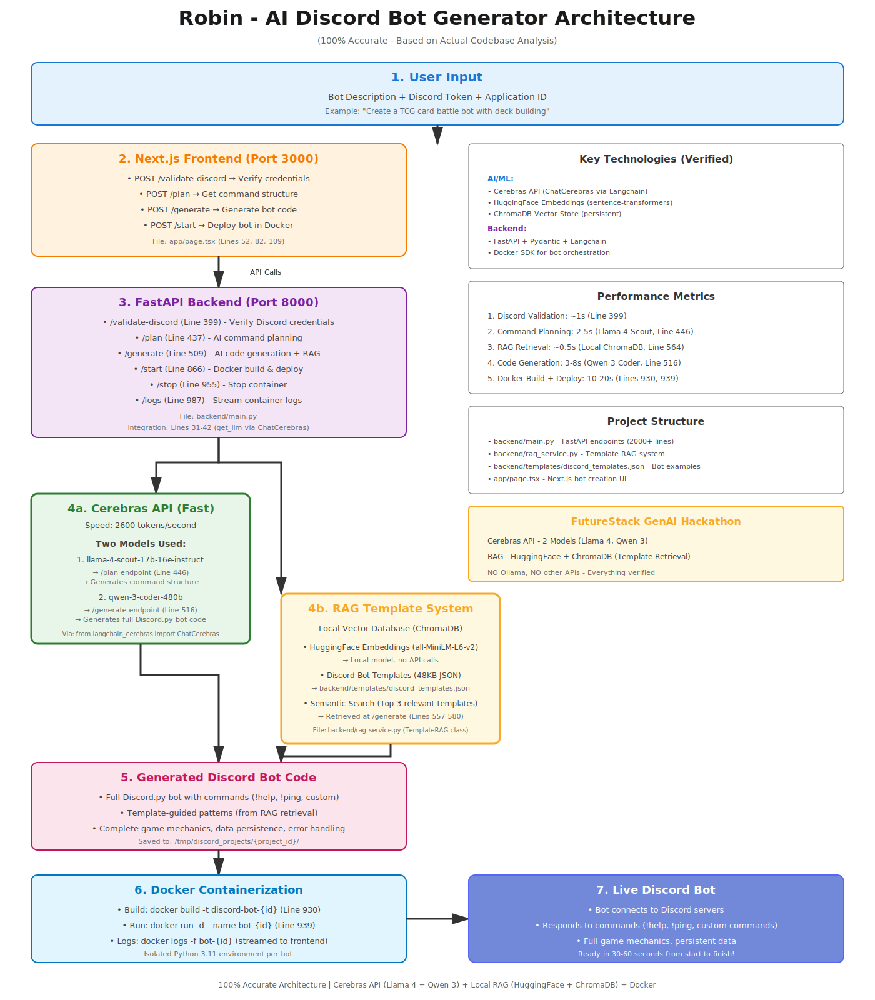

# Robin - AI Discord Bot Generator 🤖

[](https://cloud.cerebras.ai)
[](https://www.trychroma.com/)

> **Generate production-ready Discord bots in under a minute using natural language and bleeding-edge AI.**

**Cerebras API** (2600 tokens/s) + **RAG** (HuggingFace + ChromaDB)

---

## 🎯 What is Robin?

Robin transforms a simple text description into a **fully functional Discord bot** running in Docker:

```
Input: "Create a moderation bot with a profanity filter"
          ↓ under a minute later ↓
Output: Live Discord bot with !filter, !warn, !mute, !ban commands
```

**No coding required.** Just describe what you want, and Robin's dual-AI system (Cerebras + RAG) handles everything:
- Command planning & structure
- Full Discord.py code generation
- Docker containerization & deployment
- Real-time bot execution

---

## 🏆 Hackathon Integration: Cerebras API + RAG

### ⚡ Cerebras API - Lightning-Fast Code Generation

**Why Cerebras?** World's fastest AI inference (2600 tokens/second) on custom silicon chips.

**Primary Model:**

**Llama 4 Maverick 17B (128e-instruct)** - Universal AI Engine
   - Command planning & structure analysis
   - Complete Discord.py bot generation
   - AI assistant for live code editing
   - Syntax error auto-fixing
   - Locations: `/plan`, `/generate`, `/ai-assist` endpoints

**Integration:**
```python
from langchain_cerebras import ChatCerebras

# Single powerful model for all AI tasks
llm = ChatCerebras(model="llama-4-maverick-17b-128e-instruct")
```

**Why Llama 4 Maverick?**
- Latest Llama 4 model with enhanced instruction following
- 128e variant optimized for code generation
- Ultra-fast inference on Cerebras silicon (2600 tokens/s)

### 🧠 RAG System - Best Practices Integration

**Local Vector Database:** Once the embedding model is downloaded, retrieval runs fully on-device.

**Stack:**
- **HuggingFace Embeddings** - `sentence-transformers/all-MiniLM-L6-v2` (local model)
- **ChromaDB** - Persistent vector store for Discord.py patterns
- **~47 KB Knowledge Library** - Curated Discord bot best practices

**How It Works:**
1. User describes bot → RAG finds top 3 similar patterns
2. Patterns provide proven approaches (game mechanics, commands, data structures)
3. Cerebras generates code using RAG guidance
4. Result: Higher-quality bots with best practices baked in

**Location:** [rag_service.py](backend/rag_service.py) (RAG system)

## 🏗️ Architecture



**Key Files:**
- [backend/main.py](backend/main.py) - FastAPI endpoints (1000+ lines)
- [backend/rag_service.py](backend/rag_service.py) - RAG system for best practices
- [app/page.tsx](app/page.tsx) - Next.js UI

---

## ✨ Features That Stand Out

### 🎯 Natural Language → Working Code
No bot framework knowledge needed. Describe functionality in plain English:
- "Make a moderation bot with kick/ban/mute"
- "Create an economy bot with virtual currency"

### 🤖 AI-Powered System
- **Cerebras Llama 4 Maverick** for technical excellence (code structure, logic)
- **RAG** for proven patterns (game mechanics, best practices)
- Combined: Ultra-fast generation + high-quality output

### 🚀 One-Click Deploy
- Automatic Dockerfile generation
- Isolated containers per bot (no conflicts)
- Real-time logs streamed to frontend
- Stop/restart from UI

### 💻 Built-in Code Editor
- Monaco Editor integration
- Live syntax highlighting
- Edit generated code before deploy
- Full Discord.py environment

### 📊 Production-Ready Bots
Generated bots include:
- Error handling & validation
- Help commands with embed formatting
- Persistent data storage (JSON)
- Clean command structure
- Proper async/await patterns

---

## 🚀 Quick Start

### Prerequisites
- **Docker Desktop** - Must be running
- **Node.js 18+** - For Next.js frontend
- **Python 3.11+** - For FastAPI backend
- **Cerebras API Key** - [Get free key here](https://cloud.cerebras.ai)
- **Discord Bot Token** - [Create bot here](https://discord.com/developers/applications)

### Installation

```bash
# Clone repo
git clone <your-repo-url>
cd robin

# Install dependencies
npm install
pip install -r requirements.txt

# Configure environment
cp env.example .env
# Edit .env and add your CEREBRAS_API_KEY
```

### Run

```bash
# Terminal 1: Start backend
./restart-backend.sh
# Backend runs on http://localhost:8000

# Terminal 2: Start frontend
npm run dev
# Frontend runs on http://localhost:3000
```

Open [http://localhost:3000](http://localhost:3000) and create your first bot!

---

## 🎮 Example Use Cases

- Moderation helper with warning, kick, and ban commands
- Party DJ bot that manages a shared music queue
- Study buddy that stores notes and summarizes research topics

---

## 🔧 Technology Stack

### AI & Automation
| Component | Purpose |
|-----------|---------|
| **Cerebras API** (via `langchain-cerebras`) | Planning, full bot generation, and in-editor assistant replies |
| **Hugging Face** `sentence-transformers/all-MiniLM-L6-v2` | Local text embeddings for retrieval |
| **ChromaDB** | Persistent vector store for pattern guidance |

### Backend
- **FastAPI + Uvicorn** for the API server
- **Pydantic** schemas for request/response validation
- **Docker CLI via subprocess** for building and running bot containers
- **LangChain**, **aiohttp/httpx**, **python-dotenv**, and related utilities for AI workflows

### Frontend
- **Next.js 14** (App Router) with **React 19** and **TypeScript**
- **Tailwind CSS 4**, **shadcn/ui**, and Radix primitives for UI
- **Monaco Editor** integration through `@monaco-editor/react`
- Lightweight state managed with React hooks and native `fetch`

---

## 📈 Performance Metrics

| Stage | Time | Technology |
|-------|------|-----------|
| Discord Validation | ~1s | Discord API |
| Command Planning | 2-3s | Cerebras (Llama 4 Maverick) |
| RAG Pattern Retrieval | ~0.5s | ChromaDB (local) |
| Code Generation | 1-2s | Cerebras (Llama 4 Maverick) |
| Docker Build | 10-20s | Docker |
| **Total: Bot Ready** | **15-30s** | **Full Stack** |

**Throughput:** 2600 tokens/second (Cerebras API on custom silicon)

---

## 🏅 Why Robin Wins

### 1. Real-World Impact
**Problem:** Creating Discord bots requires programming skills, framework knowledge, deployment expertise.

**Solution:** Natural language → production bot in under a minute.

**Impact:** Democratizes bot development for:
- Community managers (no coding skills)
- Game creators (rapid prototyping)
- Educators (teaching tool)
- Hobbyists (weekend projects)

### 2. Technical Excellence

**Cerebras Integration:**
- Llama 4 Maverick 17B-128e for all AI tasks
- 2600 tokens/s generation (fastest available)
- Single model approach for consistency and speed
- Langchain integration for flexibility

**RAG Innovation:**
- Local embeddings (no API costs)
- Pattern-guided generation (higher quality)
- Persistent vector store (fast retrieval)

**Full-Stack Polish:**
- Docker isolation (safe, scalable)
- Real-time logs (developer experience)
- Monaco editor (professional UX)
- Error handling throughout

### 3. Novelty & Creativity

**Unique Approach:** Dual-AI system (Cerebras + RAG) beats single-model approaches
- Cerebras for speed + technical accuracy
- RAG for proven patterns + best practices
- Combined: Fast, correct, and high-quality

**Smart Architecture:** Pattern retrieval guides generation
- ~47 KB curated Discord.py knowledge base
- Semantic search finds similar examples
- Cerebras adapts patterns to user needs

### 4. Completeness

Not just a code generator - **complete bot creation platform:**
- ✅ Planning (AI command structure)
- ✅ Generation (full Discord.py code)
- ✅ Editing (Monaco code editor)
- ✅ Deployment (Docker containers)
- ✅ Monitoring (real-time logs)
- ✅ Management (start/stop/restart)

---

## 🎓 Learning & Growth

### Skills Acquired During Hackathon

**Cerebras API:**
- Llama 4 Maverick integration for plan/generate/assist endpoints
- LangChain ChatCerebras workflow patterns
- Handling high-throughput API responses with retries and validation
- Single-model architecture for consistency

**RAG Systems:**
- HuggingFace embeddings (local deployment)
- ChromaDB setup & persistence
- Semantic search implementation
- Knowledge base engineering

**Full-Stack Integration:**
- FastAPI async patterns
- Docker CLI automation via subprocess
- Next.js App Router UI with custom hooks
- Real-time log forwarding to the editor

**Discord Ecosystem:**
- Bot authentication flows
- Discord.py best practices
- Embed formatting
- Permission management

---


## 🤝 Contributing

Robin is built for the hackathon but open for contributions:

```bash
# Fork repo, make changes, submit PR
git checkout -b feature/your-feature
git commit -m "Add amazing feature"
git push origin feature/your-feature
```

---

## 📝 License

MIT License - Free to use, modify, distribute.

---

## 🙏 Acknowledgments

**Cerebras** - For providing the world's fastest AI inference (Llama 4 Maverick)

**Open Source Community** - Langchain, ChromaDB, HuggingFace, FastAPI, Next.js, shadcn/ui

---

<div align="center">

**Built with ❤️ using Cerebras API, RAG, and bleeding-edge AI**

*Generate your first Discord bot in under a minute at [localhost:3000](http://localhost:3000)*

</div>
