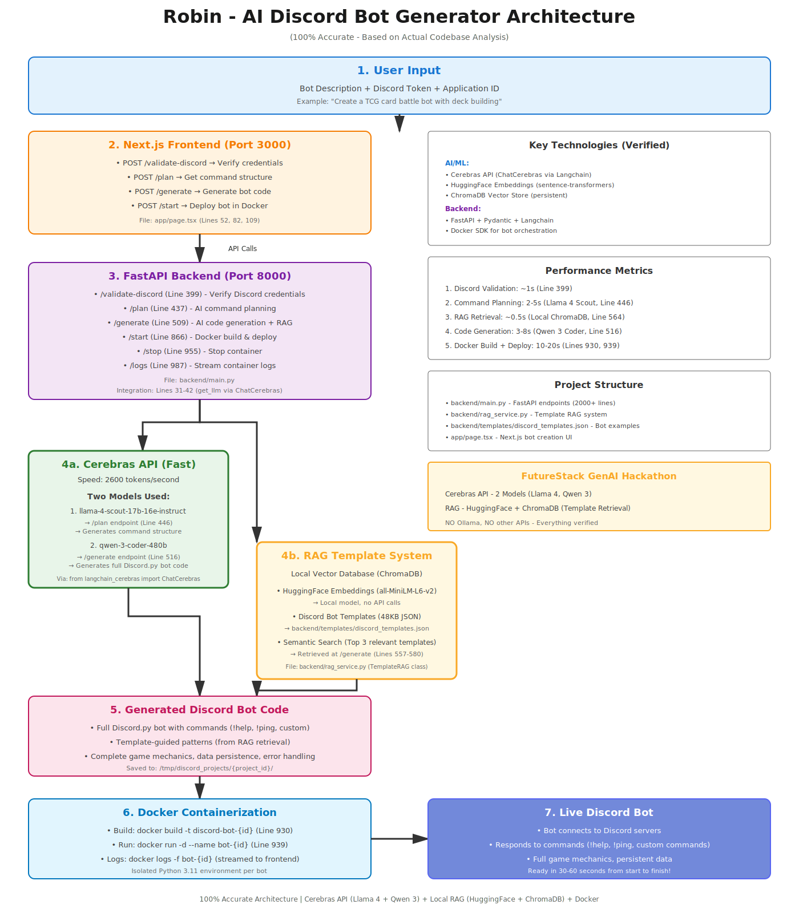

# Robin - AI Discord Bot Generator 🤖

[](https://cloud.cerebras.ai)
[](https://www.trychroma.com/)

> **Generate production-ready Discord bots in 30 seconds using natural language and bleeding-edge AI.**

**Cerebras API** (2600 tokens/s) + **RAG** (HuggingFace + ChromaDB)

---

## 🎯 What is Robin?

Robin transforms a simple text description into a **fully functional Discord bot** running in Docker:

```
Input: "Create a TCG card battle bot with deck building and PvP battles"
          ↓ 30 seconds later ↓
Output: Live Discord bot with !collect, !battle, !deck, !cards commands
```

**No coding required.** Just describe what you want, and Robin's dual-AI system (Cerebras + RAG) handles everything:
- Command planning & structure
- Full Discord.py code generation
- Docker containerization & deployment
- Real-time bot execution

---

## 🏆 Hackathon Integration: Cerebras API + RAG

### ⚡ Cerebras API - Lightning-Fast Code Generation

**Why Cerebras?** World's fastest AI inference (2600 tokens/second) on custom silicon chips.

**Two Models, Two Jobs:**

1. **Llama 4 Scout 17B** - Command Planning
   - Analyzes bot descriptions
   - Structures command hierarchies
   - Plans bot behavior logic
   - Location: `/plan` endpoint ([main.py:446](backend/main.py#L446))

2. **Qwen 3 Coder 480B** - Code Generation
   - Generates complete Discord.py bots
   - Implements game mechanics, data persistence
   - Creates error handling & validation
   - Location: `/generate` endpoint ([main.py:516](backend/main.py#L516))

**Integration:**
```python
from langchain_cerebras import ChatCerebras

# Two-model approach for optimal performance
llm_planning = ChatCerebras(model="llama-4-scout-17b-16e-instruct")
llm_coding = ChatCerebras(model="qwen-3-coder-480b")
```

### 🧠 RAG System - Template-Guided Generation

**Local Vector Database:** No external API calls, blazing fast retrieval.

**Stack:**
- **HuggingFace Embeddings** - `sentence-transformers/all-MiniLM-L6-v2` (local model)
- **ChromaDB** - Persistent vector store for bot templates
- **48KB Template Library** - Curated Discord bot patterns

**How It Works:**
1. User describes bot → RAG finds top 3 similar templates
2. Templates provide proven patterns (game mechanics, commands, data structures)
3. Cerebras generates code using template guidance
4. Result: Higher-quality bots with best practices baked in

**Location:** [rag_service.py](backend/rag_service.py) (TemplateRAG class)

## 🏗️ Architecture



**Key Files:**
- [backend/main.py](backend/main.py) - FastAPI endpoints (1000+ lines)
- [backend/rag_service.py](backend/rag_service.py) - Template RAG system
- [app/page.tsx](app/page.tsx) - Next.js UI
- [backend/templates/discord_templates.json](backend/templates/discord_templates.json) - Bot templates

---

## ✨ Features That Stand Out

### 🎯 Natural Language → Working Code
No bot framework knowledge needed. Describe functionality in plain English:
- "Make a moderation bot with kick/ban/mute"
- "Build a music bot with queue management"
- "Create an economy bot with virtual currency"

### 🤖 Dual AI System
- **Cerebras** for technical excellence (code structure, logic)
- **RAG** for proven patterns (game mechanics, best practices)
- Best of both: Fast generation + high-quality output

### 🚀 One-Click Deploy
- Automatic Dockerfile generation
- Isolated containers per bot (no conflicts)
- Real-time logs streamed to frontend
- Stop/restart from UI

### 💻 Built-in Code Editor
- Monaco Editor integration
- Live syntax highlighting
- Edit generated code before deploy
- Full Discord.py environment

### 📊 Production-Ready Bots
Generated bots include:
- Error handling & validation
- Help commands with embed formatting
- Persistent data storage (JSON)
- Clean command structure
- Proper async/await patterns

---

## 🚀 Quick Start

### Prerequisites
- **Docker Desktop** - Must be running
- **Node.js 18+** - For Next.js frontend
- **Python 3.11+** - For FastAPI backend
- **Cerebras API Key** - [Get free key here](https://cloud.cerebras.ai)
- **Discord Bot Token** - [Create bot here](https://discord.com/developers/applications)

### Installation

```bash
# Clone repo
git clone <your-repo-url>
cd robin

# Install dependencies
npm install
pip install -r requirements.txt

# Configure environment
cp env.example .env
# Edit .env and add your CEREBRAS_API_KEY
```

### Run

```bash
# Terminal 1: Start backend
./restart-backend.sh
# Backend runs on http://localhost:8000

# Terminal 2: Start frontend
npm run dev
# Frontend runs on http://localhost:3000
```

Open [http://localhost:3000](http://localhost:3000) and create your first bot!

---

## 🎮 Example Bots

### TCG Card Battle Bot
```
Description: "Create a TCG card battle bot with deck building"

Generated Commands:
!collect <rarity> - Collect random cards
!battle @player - Battle another player
!deck - View your deck
!cards - Browse all cards
!inventory - Check your collection

Result: Full card game with:
- 50+ unique cards (different rarities)
- Turn-based battle system
- Deck customization
- Persistent player data
```

### Moderation Bot
```
Description: "Moderation bot with warnings and auto-punishments"

Generated Commands:
!warn @user <reason> - Warn a user
!kick @user - Kick member
!ban @user - Ban member
!warnings @user - Check warning count
!clearwarns @user - Clear warnings

Result: Complete moderation suite with:
- Warning accumulation
- Auto-kick at 3 warnings
- Mod-only permissions
- Audit logging
```

### Research Assistant Bot
```
Description: "Research bot for gathering and summarizing information"

Generated Commands:
!research <topic> - Research a topic
!summarize <text> - Summarize content
!save <name> - Save research to library
!library - View saved research

Result: AI-powered research tool with:
- Web search integration
- Text summarization
- Research library
- Citation tracking
```

---

## 🔧 Technology Stack

### AI & ML
| Technology | Purpose | Model/Version |
|-----------|---------|---------------|
| **Cerebras API** | Code generation | Qwen 3 Coder 480B |
| **Cerebras API** | Command planning | Llama 4 Scout 17B |
| **HuggingFace** | Text embeddings | all-MiniLM-L6-v2 |
| **ChromaDB** | Vector storage | Persistent DB |
| **Langchain** | LLM orchestration | ChatCerebras |

### Backend
- **FastAPI** - Modern Python web framework
- **Docker SDK** - Container orchestration
- **Pydantic** - Data validation
- **Discord.py** - Bot framework (generated code)

### Frontend
- **Next.js 14** - React framework with App Router
- **Tailwind CSS v4** - Utility-first styling
- **shadcn/ui** - Beautiful UI components
- **Monaco Editor** - VSCode-powered code editor
- **React Query** - State management

---

## 📈 Performance Metrics

| Stage | Time | Technology |
|-------|------|-----------|
| Discord Validation | ~1s | Discord API |
| Command Planning | 2-5s | Cerebras (Llama 4 Scout) |
| Template Retrieval | ~0.5s | ChromaDB (local) |
| Code Generation | 3-8s | Cerebras (Qwen 3 Coder) |
| Docker Build | 10-20s | Docker |
| **Total: Bot Ready** | **30-60s** | **Full Stack** |

**Throughput:** 2600 tokens/second (Cerebras API on custom silicon)

---

## 🏅 Why Robin Wins

### 1. Real-World Impact
**Problem:** Creating Discord bots requires programming skills, framework knowledge, deployment expertise.

**Solution:** Natural language → production bot in 30 seconds.

**Impact:** Democratizes bot development for:
- Community managers (no coding skills)
- Game creators (rapid prototyping)
- Educators (teaching tool)
- Hobbyists (weekend projects)

### 2. Technical Excellence

**Cerebras Integration:**
- Two models for optimal performance (planning + coding)
- 2600 tokens/s generation (fastest available)
- Langchain integration for flexibility

**RAG Innovation:**
- Local embeddings (no API costs)
- Template-guided generation (higher quality)
- Persistent vector store (fast retrieval)

**Full-Stack Polish:**
- Docker isolation (safe, scalable)
- Real-time logs (developer experience)
- Monaco editor (professional UX)
- Error handling throughout

### 3. Novelty & Creativity

**Unique Approach:** Dual-AI system (Cerebras + RAG) beats single-model approaches
- Cerebras for speed + technical accuracy
- RAG for proven patterns + best practices
- Combined: Fast, correct, and high-quality

**Smart Architecture:** Template retrieval guides generation
- 48KB curated Discord bot patterns
- Semantic search finds similar examples
- Cerebras adapts patterns to user needs

### 4. Completeness

Not just a code generator - **complete bot creation platform:**
- ✅ Planning (AI command structure)
- ✅ Generation (full Discord.py code)
- ✅ Editing (Monaco code editor)
- ✅ Deployment (Docker containers)
- ✅ Monitoring (real-time logs)
- ✅ Management (start/stop/restart)

---

## 🎓 Learning & Growth

### Skills Acquired During Hackathon

**Cerebras API:**
- Multi-model strategies (Llama 4 + Qwen 3)
- Langchain integration patterns
- Token optimization for speed
- Model selection for use cases

**RAG Systems:**
- HuggingFace embeddings (local deployment)
- ChromaDB setup & persistence
- Semantic search implementation
- Template engineering

**Full-Stack Integration:**
- FastAPI async patterns
- Docker SDK automation
- Next.js streaming responses
- Real-time log forwarding

**Discord Ecosystem:**
- Bot authentication flows
- Discord.py best practices
- Embed formatting
- Permission management

---


## 🤝 Contributing

Robin is built for the hackathon but open for contributions:

```bash
# Fork repo, make changes, submit PR
git checkout -b feature/your-feature
git commit -m "Add amazing feature"
git push origin feature/your-feature
```

---

## 📝 License

MIT License - Free to use, modify, distribute.

---

## 🙏 Acknowledgments

**Cerebras** - For providing the world's fastest AI inference

**Open Source Community** - Langchain, ChromaDB, HuggingFace, FastAPI, Next.js, shadcn/ui

---

<div align="center">

**Built with ❤️ using Cerebras API, RAG, and bleeding-edge AI**

*Generate your first Discord bot in 30 seconds at [localhost:3000](http://localhost:3000)*

</div>
